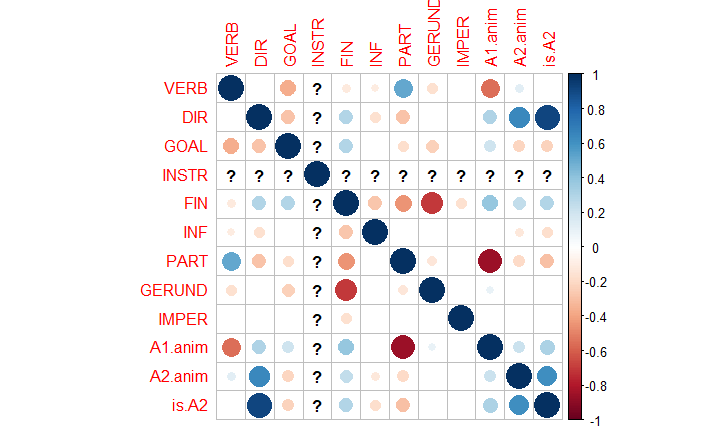
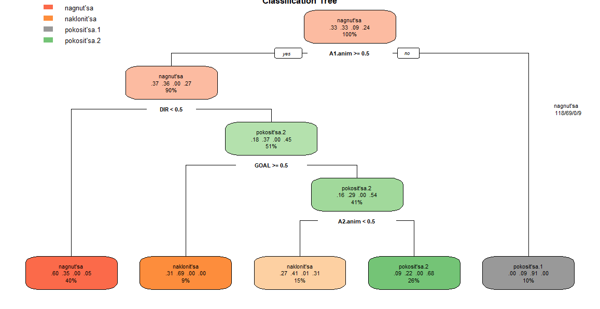
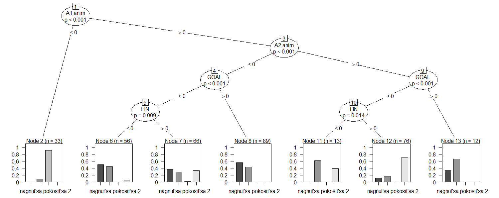
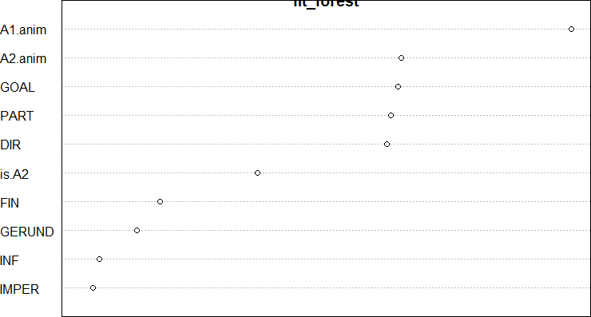

# Название проекта

### Материалы
[Ссылка на таблицу с данными](https://docs.google.com/spreadsheets/d/1Pdpd7f0ApJH8lMs1G6f5I2mgbSXEPdUsPxuw_ftExy4/edit#gid=0)
[Ссылка на папку с разными таблицами](https://github.com/s-klimenko/CxG/tree/master/data)  
[Ссылка на код, здесь целиком с комментарием](https://github.com/s-klimenko/CxG/blob/master/project.R) ( или ниже по тексту отдельными блоками )

## Рабочая гипотеза

В русском языке существуют три синонимичных глагола: наклониться, нагнуться, покоситься. При помощи этого исследования, мы хотим узнать какие параметры влияют на выбор конкретного глагола.

Важно отметить, что глагол покоситься имеет два значения:
* покоситься.1 - искривиться, наклониться, стать косым
* покоситься.2 - посмотреть искоса, вбок.

Обзор данных показал, что глагол покоситься.1, в отличие от остальных, употребляется исключительно с неодушевленными субъектами. Различие между контекстами наклониться и нагнуться было решено выяснить в процессе исследования.

## Данные

### Материал исследования
Для исследования из Национального корпуса русского языка было собрано:
* 164 примеров с глаголом наклониться
* 164 примеров с глаголом нагнуться
* 164 примеров с глаголом покоситься (из которых 44 оказалось со значением покоситься.1, а 120 со значением покоситься.2)

Наибольшую трудность составила разметка цели и направления. В целом, целью считались конструкции типа "наклониться сделать", "наклониться чтобы сделать". "наклониться и сделать" только в случае, если действие нельзя сделать без наклона (сравни "наклонился и поднял камень" и "наклонился и сказал")
Конструкциями направления чаще всего считались конструкции с предлогом, кроме за.
Эти теги не являются взамоисключающими.

### Факторы выбора конструкции

* Целевой переменной являлся выбранный глагол (наклониться, нагнуться, покоситься.1, покоситься.2)
Кроме того, было выделены следующие переменные:
* наличие или отсутствие предлога (Маша нагнулась vs Маша нагнулась к Кате) 
* значение направления или цели (наклониться к ручью vs наклониться за кошельком)
* наличие инструмента (покоситься глазами, наклониться всем телом)
* одушевленность субъекта (забор наклонился vs Маша наклонилась)
* одушевленность объекта (Вася наклонился к Пете vs Вася наклонился к ручью)
* форма глагола (финитная, инфинитив, императив, деепричастие, причастие)

## Анализ: дескриптивная статистика

Как видно из матрицы корреляции с целевой переменной наиболее коррелируют значение цели, одушевленность субъекта и наличие предлога. Кроме того, есть небольшая корреляция с формой глагола (финитная, инфинитив, деепричастие) и одушевленностью объекта.

## Мультифакторный анализ

При использовании всех коррелирующих переменных, дерево решений принимает следующий вид:

Оно же:

Исключаем форму, оставляем только цель, одушевленность объекта и субъекта и наличие предлога:

Глагол покоситься.1 употребляется исключительно с неодушевленным субъектом.
Глагол покоситься.2 не употребляется в значении цели.
Глагол наклониться преимущественно употребляется со значением цели.
Глагол нагнуться чаще употреблятся с неодушевленным субъектом.

## Содержательный лингвистический анализ результатов статистического анализа

Действительно, форма глагола практически не влияет на результат, в то время как цель, одушевленность и наличие предлога являются важными переменными.

## Обсуждение использованных квантитативных методов
Accuracy составила 60%. Скорее всего такое маленькое значение получилось из-за маленького количества материала и неравномерного распределения выборки.
